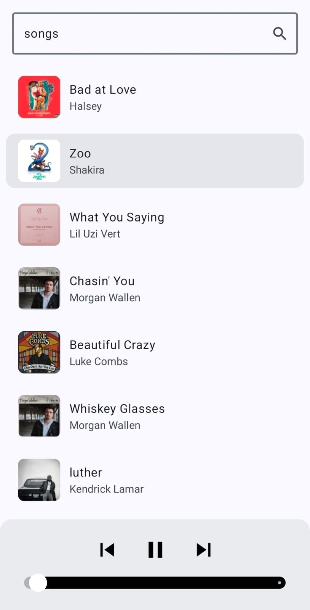

# My Music App

A modern Android music player built with **Jetpack Compose**, **MVVM**, **Hilt**, **Retrofit**, **Coil 3**, and **AndroidX Media3 ExoPlayer**.

The application allows users to search songs from the iTunes Search API, browse results with artwork previews, and play song previews using a bottom music player drawer that appears only when a song is selected.

---

## Features
- Search music
- Music list
- Music Player

### Architecture
- MVVM Architecture
- Repository Pattern
- Dependency Injection
- StateFlow State Management
- Single Source of Truth

---

# API

This application uses the iTunes Search API.

### Example Request

```http
GET https://itunes.apple.com/search?term=best+song&media=music&entity=song&limit=10
```

### Parameters

| Parameter | Value |
|------------|------------|
| term | Search Keyword |
| media | music |
| entity | song |
| limit | Number of Results |

---

# Architecture

The project follows a clean MVVM architecture.

```text
com.my.music.app

├── MainActivity.kt
├── MainApplication.kt
├── data
├── di
├── model
├── viewModel
├── page
```

---

# Tech Stack

## UI

- Jetpack Compose
- Material 3
- Material Icons Extended

## Architecture

- MVVM
- Repository Pattern
- StateFlow

## Dependency Injection

- Hilt 2.60.1
- KSP

## Networking

- Retrofit 3.0.0
- Gson Converter

## Image Loading

- Coil 3.6.2
- Coil Network OkHttp 3.6.2

## Media Playback

- AndroidX Media3 ExoPlayer 1.11.0

---

# Dependencies

## Versions

| Dependency | Version |
|------------|------------|
| AGP | 9.4.0 |
| Kotlin | 2.4.10 |
| Compose BOM | 2026.08.00 |
| Lifecycle | 2.11.0 |
| Retrofit | 3.0.0 |
| Hilt | 2.60.1 |
| Hilt Compose | 1.4.0 |
| Coil | 3.6.2 |
| Media3 | 1.11.0 |
| KSP | 2.3.10 |

---

# Build Requirements

| Requirement | Version |
|------------|------------|
| Android Studio | Latest Stable |
| Compile SDK | 37 |
| Target SDK | 36 |
| Min SDK | 26 |
| Java | 17 |
| Kotlin | 2.4.10 |

---

# Future Improvements

- Background playback
- Media notification controls
- Offline caching
- Recently played songs
- Favorites playlist
- Dark mode customization

---

# Screenshots

Add screenshots here after running the application.

```md


```
